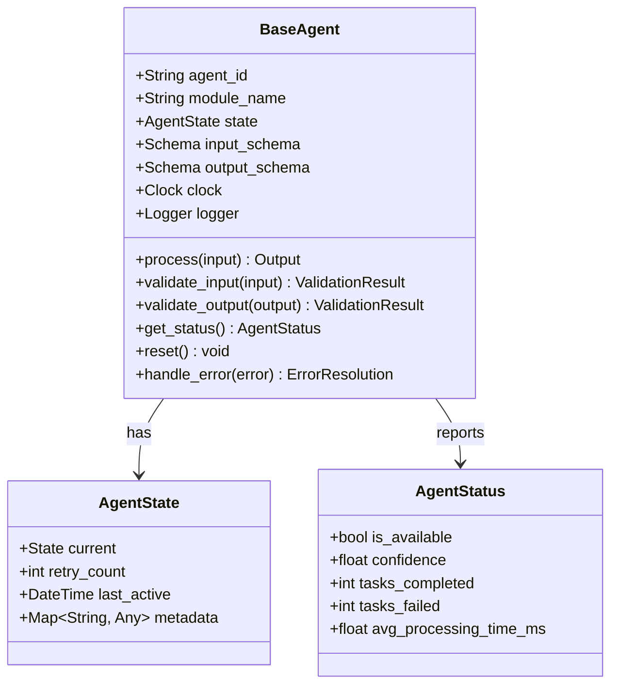
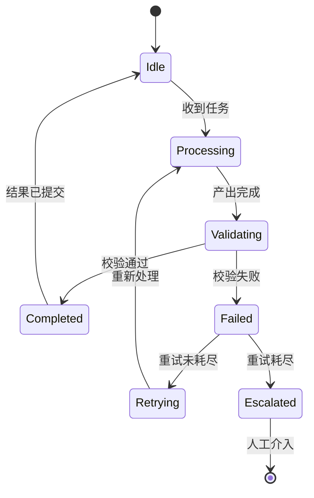
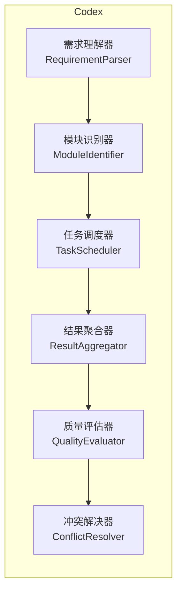
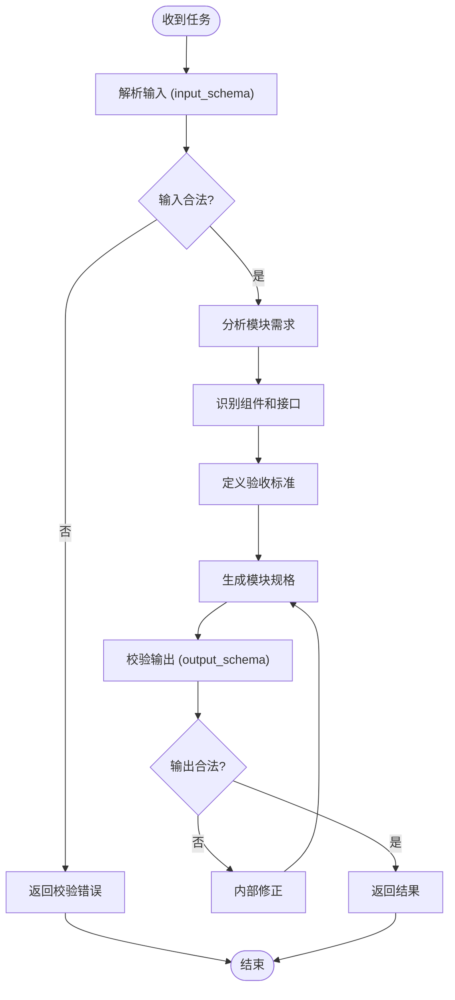
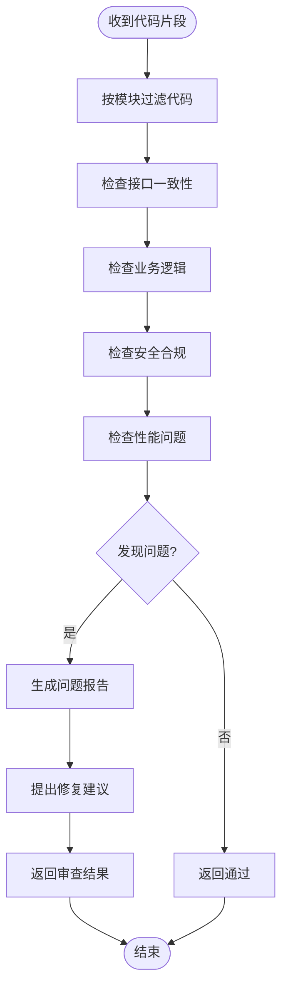
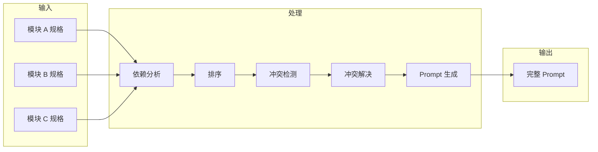
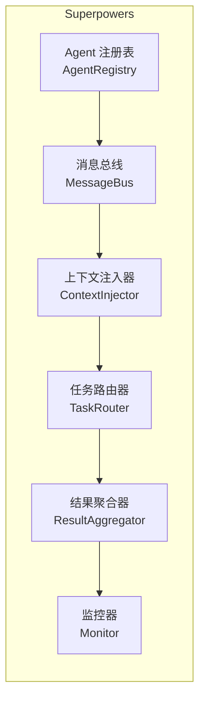

# Agent 详细设计

> 本文档定义每个 Agent 的内部结构、行为规范和实现约束。

---

## 1. Agent 基类设计



### 状态定义



---

## 2. Codex 主管 Agent 详细设计

### 2.1 内部组件



### 2.2 需求理解器

```python
class RequirementParser:
    """将自然语言需求解析为结构化需求对象"""

    def parse(self, raw_text: str) -> Requirement:
        """
        输入: "用户需要一个支持 JWT 认证的在线商城，
               包含购物车、订单和支付功能"
        输出: Requirement(
            functional_modules=["auth", "cart", "order", "payment"],
            non_functional=["performance", "security"],
            constraints=["JWT-RS256", "24h-token"],
            priority="high"
        )
        """
        ...
```

### 2.3 模块识别器

```python
class ModuleIdentifier:
    """根据需求识别功能模块，匹配已有 Agent"""

    def identify(self, requirement: Requirement) -> List[ModuleTask]:
        """
        根据需求中的功能关键词，匹配 Superpowers 注册表中
        的 Agent capabilities，生成模块任务列表
        """
        ...
```

### 2.4 质量评估器

```python
class QualityEvaluator:
    """评估代码审查结果，决定是否通过"""

    def evaluate(self, review_results: List[ReviewResult]) -> QualityReport:
        """
        评估维度:
        - 各模块审查是否通过
        - 跨模块接口是否一致
        - 代码覆盖率是否达标
        - 安全扫描是否通过
        """
        ...
```

---

## 3. 专家 Agent 详细设计

### 3.1 通用行为流程



### 3.2 审查行为流程



### 3.3 各模块专家差异

| 模块 | 核心关注点 | 验收维度 | 常见依赖 |
|------|-----------|----------|----------|
| 认证 | 加密算法、token 生命周期、会话管理 | 安全性、用户体验 | 数据库、缓存 |
| 订单 | 状态机、事务一致性、库存扣减 | 数据一致性、并发安全 | 数据库、消息队列 |
| 支付 | 幂等性、对账、退款 | 准确性、合规性 | 第三方支付、订单 |
| 通知 | 送达率、延迟、退避策略 | 可靠性、时效性 | 消息队列、模板引擎 |
| 报表 | 数据准确性、查询性能 | 正确性、响应时间 | 数据仓库、缓存 |

---

## 4. Prompt Agent 详细设计

### 4.1 整合策略



### 4.2 Prompt 生成逻辑

```python
class PromptGenerator:
    """将模块规格整合为 Claude Code 可执行的完整 Prompt"""

    def generate(self, module_specs: List[ModuleSpec],
                 strategy: IntegrationStrategy) -> Prompt:
        """
        1. 拓扑排序：按依赖关系排列模块顺序
        2. 接口对齐：确保跨模块接口定义一致
        3. 全局约束注入：编码规范、技术栈、目录结构
        4. 分步指令：先生成基础框架，再逐个填充模块
        """
        ordered = strategy.topological_sort(module_specs)
        aligned = strategy.align_interfaces(ordered)
        constrained = strategy.inject_constraints(aligned)
        return self._build_prompt(constrained)
```

### 4.3 输出 Prompt 结构

```markdown
# 项目: [项目名称]

## 技术栈
- 语言: Python 3.12
- 框架: FastAPI
- 数据库: PostgreSQL
- 缓存: Redis

## 目录结构
```
project/
├── src/
│   ├── auth/          # 模块 A - 认证
│   ├── order/         # 模块 B - 订单
│   └── payment/       # 模块 C - 支付
├── tests/
└── config/
```

## 模块实现顺序
1. auth (无依赖)
2. payment (依赖 auth)
3. order (依赖 auth, payment)

## 模块规格
### auth
[来自专家 Agent 的完整规格]

### payment
[来自专家 Agent 的完整规格]

### order
[来自专家 Agent 的完整规格]

## 全局约束
- 所有 API 返回统一响应格式
- 错误码遵循 RFC 7807
- 日志使用结构化 JSON 格式
```

---

## 5. Superpowers 插件详细设计

### 5.1 核心组件



### 5.2 Agent 注册表

```python
class AgentRegistry:
    """维护所有已注册的专家 Agent"""

    _registry: Dict[str, AgentRegistration] = {}

    def register(self, agent: BaseAgent) -> None:
        """注册 Agent，校验 Schema 兼容性"""
        self._validate_schemas(agent)
        self._registry[agent.agent_id] = AgentRegistration(
            agent=agent,
            module=agent.module_name,
            capabilities=agent.get_capabilities(),
            registered_at=datetime.utcnow()
        )

    def find_by_module(self, module: str) -> Optional[BaseAgent]:
        """根据模块名查找对应 Agent"""
        for reg in self._registry.values():
            if reg.module == module:
                return reg.agent
        return None

    def find_by_capability(self, capability: str) -> List[BaseAgent]:
        """根据能力查找 Agent"""
        return [reg.agent for reg in self._registry.values()
                if capability in reg.capabilities]
```

### 5.3 上下文注入器

```python
class ContextInjector:
    """为每个 Agent 注入最小必要上下文"""

    def inject(self, agent_id: str, task: Task) -> EnrichedTask:
        """
        注入规则:
        1. 只包含该模块的需求描述
        2. 只包含依赖模块的接口定义（不含实现）
        3. 包含全局约束（编码规范、技术栈）
        4. 不包含其他模块的任何信息
        """
        module_context = self._extract_module_context(task, agent_id)
        dependency_interfaces = self._get_dependency_interfaces(task, agent_id)
        global_constraints = self._get_global_constraints()

        return EnrichedTask(
            original=task,
            module_context=module_context,
            dependency_interfaces=dependency_interfaces,
            global_constraints=global_constraints
        )
```

### 5.4 消息总线

```python
class MessageBus:
    """Agent 间通信的唯一通道"""

    def __init__(self):
        self._queues: Dict[str, Queue] = defaultdict(Queue)
        self._history: List[Message] = []

    def publish(self, message: Message) -> None:
        """发布消息到目标 Agent 的队列"""
        self._history.append(message)
        self._queues[message.meta.to].put(message)

    def subscribe(self, agent_id: str) -> Queue:
        """订阅消息队列"""
        return self._queues[agent_id]

    def get_history(self, agent_id: str = None) -> List[Message]:
        """获取通信历史（用于审计和调试）"""
        if agent_id:
            return [m for m in self._history
                    if m.meta.to == agent_id or m.meta.from_ == agent_id]
        return self._history
```

---

## 6. 实现约束清单

### 6.1 必须遵守

- [ ] 所有 Agent 必须继承 BaseAgent
- [ ] 所有输入输出必须符合声明的 Schema
- [ ] Agent 间通信必须经过 Superpowers 消息总线
- [ ] 不允许 Agent 直接访问文件系统
- [ ] 不允许 Agent 直接调用其他 Agent
- [ ] 每个 Agent 必须有完整的单元测试

### 6.2 建议遵守

- [ ] 处理时间不超过 30 秒
- [ ] 置信度低于 0.7 时标记为低置信度
- [ ] 每次处理完成后清理内部状态
- [ ] 日志使用结构化格式

---

*文档结束*
