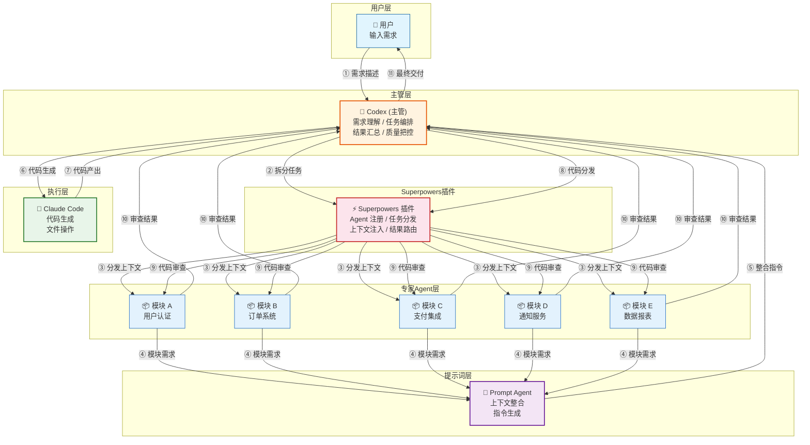
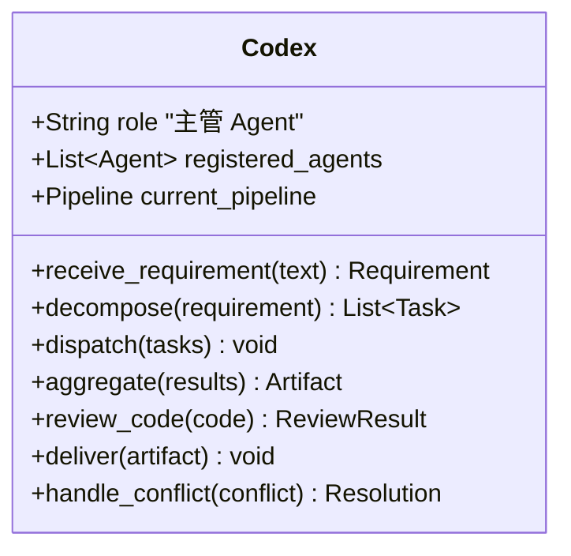
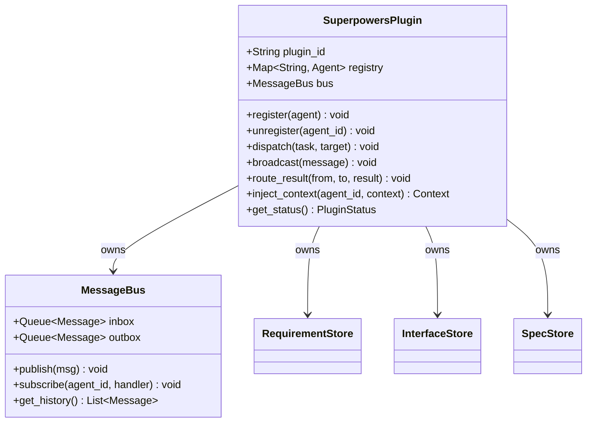
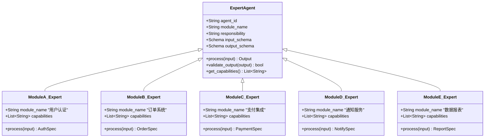
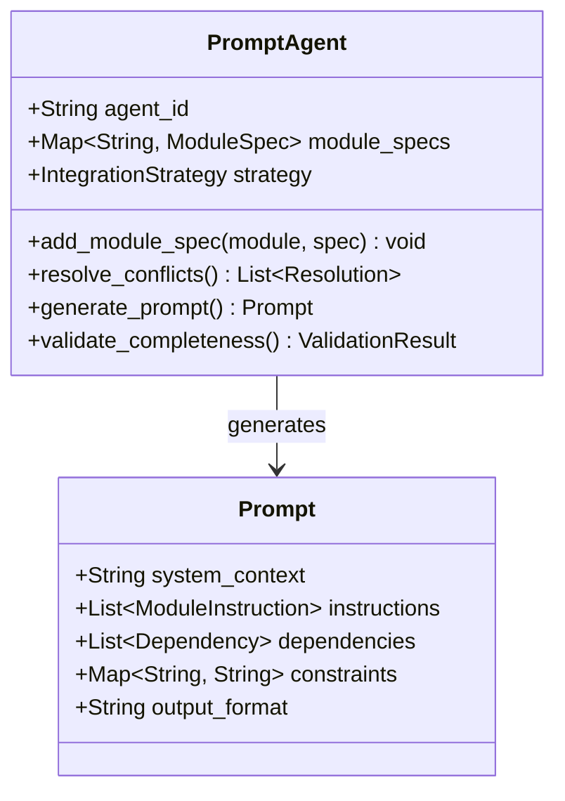
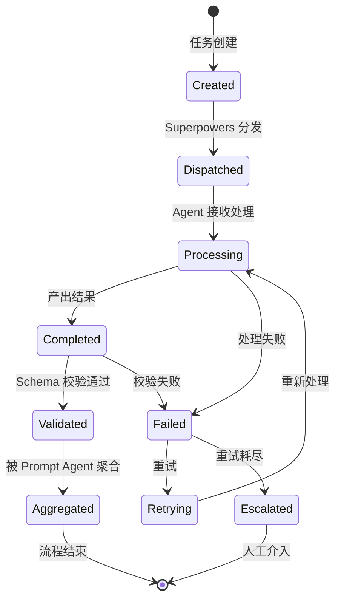
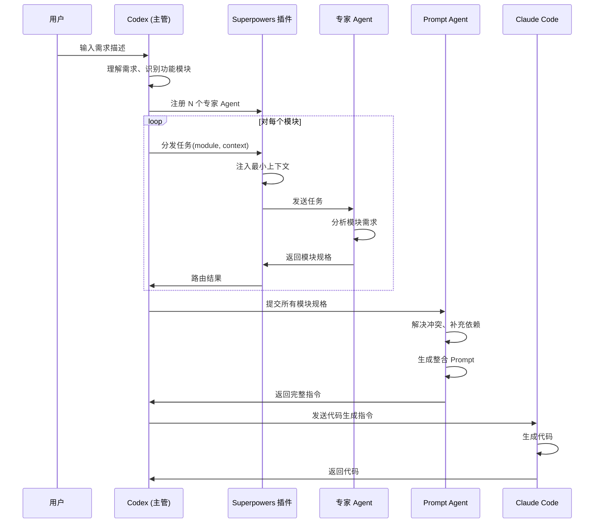
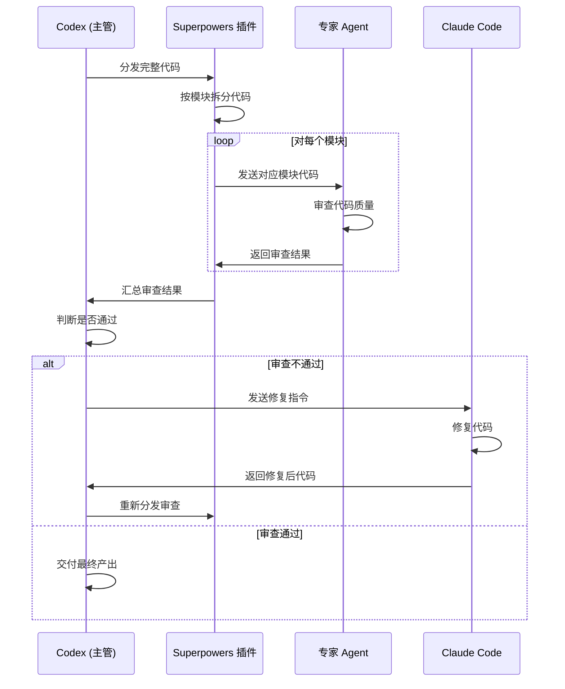
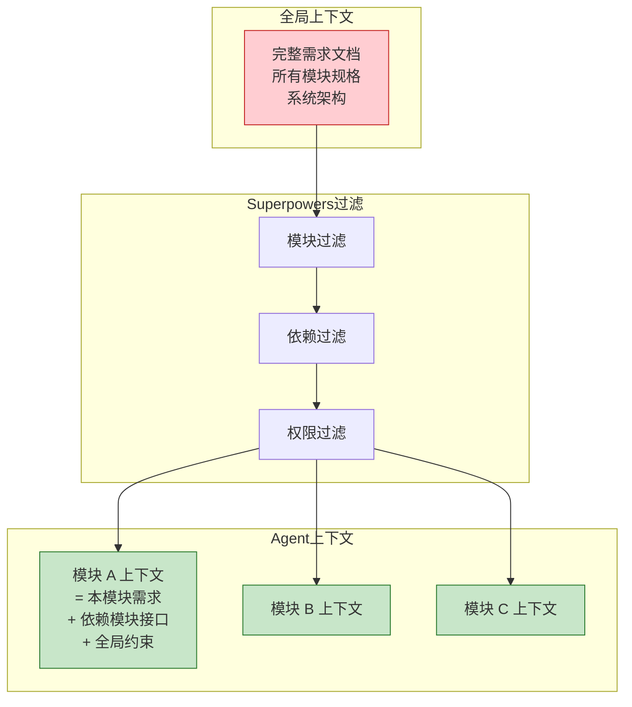
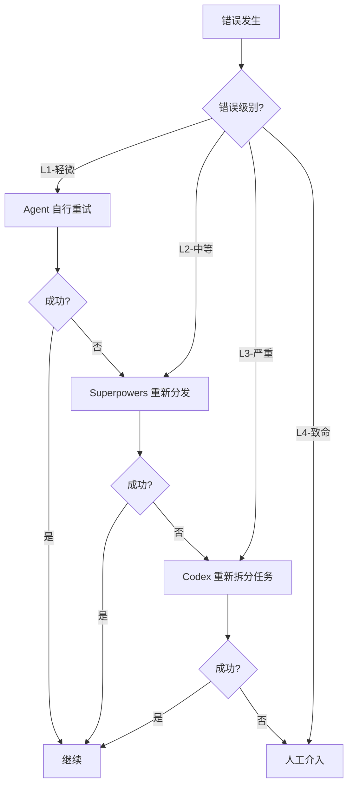

# Claude-Codex Multi-Agent 架构设计文档

> **版本**: v1.0 | **日期**: 2026-06-23 | **状态**: 设计稿

---

## 1. 系统概述

### 1.1 定位

Claude-Codex Multi-Agent 是一个**分层编排的多 Agent 协作系统**，用于将用户需求自动拆解、分配给专家子 Agent 并行处理、再汇总为可执行代码的完整开发流水线。

### 1.2 核心设计原则

| 原则 | 含义 | 落地方式 |
|------|------|----------|
| **单一职责** | 每个子 Agent 只负责一个功能模块 | 按功能域拆分，禁止跨模块操作 |
| **最小权限** | 子 Agent 只访问完成任务所需的最小上下文 | 上下文隔离 + 按需注入 |
| **独立可测** | 每个子 Agent 可独立运行和验证 | 标准化输入输出 + 单元测试 |
| **结果可验** | 每个子 Agent 产出可被自动校验 | Schema 校验 + 验收标准 |

### 1.3 架构分层

```
┌─────────────────────────────────────────────────────┐
│                   用户交互层                         │
│              User → Codex (主管)                     │
├─────────────────────────────────────────────────────┤
│                 编排调度层                           │
│         Codex + Superpowers 插件                     │
│    (任务拆分 / 上下文分发 / 结果聚合)                │
├─────────────────────────────────────────────────────┤
│                 专家 Agent 层                        │
│  ┌──────┐ ┌──────┐ ┌──────┐ ┌──────┐ ┌──────┐     │
│  │模块 A │ │模块 B │ │模块 C │ │模块 D │ │模块 E │     │
│  └──────┘ └──────┘ └──────┘ └──────┘ └──────┘     │
├─────────────────────────────────────────────────────┤
│                 提示词工程层                         │
│            Prompt Agent (上下文整合)                  │
├─────────────────────────────────────────────────────┤
│                 代码实现层                           │
│         Claude Code (代码生成引擎)                   │
└─────────────────────────────────────────────────────┘
```

---

## 2. 系统架构图

### 2.1 整体拓扑



### 2.2 双阶段工作流

系统运行分为两个核心阶段：**需求拆分阶段** 和 **代码审查阶段**。

```mermaid
flowchart LR
    subgraph 阶段一：需求拆分
        direction TB
        P1["用户需求"] --> P2["Codex 理解需求"]
        P2 --> P3["Superpowers 拆分"]
        P3 --> P4["专家 Agent 分析模块"]
        P4 --> P5["Prompt Agent 整合"]
        P5 --> P6["Claude Code 生成代码"]
    end

    subgraph 阶段二：代码审查
        direction TB
        P7["完整代码"] --> P8["Superpowers 分发"]
        P8 --> P9["专家 Agent 审查对应模块"]
        P9 --> P10["Codex 汇总审查结果"]
        P10 --> P11{"是否通过?"}
        P11 -->|"否"| P12["Claude Code 修复"]
        P12 --> P7
        P11 -->|"是"| P13["交付"]
    end

    P6 --> P7
```

---

## 3. Agent 设计

### 3.1 Codex（主管 Agent）

**角色定位**: 项目技术负责人，全局视角的唯一决策节点。



**职责边界**:
- ✅ 理解用户需求，提取核心功能点
- ✅ 将需求拆解为功能模块任务
- ✅ 通过 Superpowers 插件分发任务
- ✅ 汇总各 Agent 产出，交付给 Claude Code
- ✅ 代码审查不通过时，决定修复策略
- ❌ 不直接编写代码
- ❌ 不直接操作文件系统

### 3.2 Superpowers 插件

**角色定位**: 消息总线 + 任务调度器，所有 Agent 间的通信枢纽。



**核心能力**:

| 能力 | 说明 |
|------|------|
| Agent 注册/发现 | 动态注册专家 Agent，维护注册表 |
| 上下文注入 | 根据任务类型，向 Agent 注入最小必要上下文（从 Store 读取） |
| 任务路由 | 将任务按模块标识路由到对应 Agent |
| 结果聚合 | 收集各 Agent 产出，统一格式返回 |
| 隔离保证 | Agent 间不直接通信，必须经过插件中转 |
| Store 管理 | RequirementStore / InterfaceStore / SpecStore 的读写 |

### 3.3 Store 组件

Superpowers 内部维护三个逻辑存储，支撑上下文注入和结果聚合：

| Store | 内容 | 写入时机 | 读取时机 |
|-------|------|----------|----------|
| RequirementStore | 各模块需求描述 + 约束 | Codex 拆分需求后 | ContextInjector 注入时 |
| InterfaceStore | 各模块的接口定义 | 专家 Agent 产出后 | ContextInjector 为依赖模块注入时 |
| SpecStore | 各模块完整 ModuleSpec | 专家 Agent 产出后 | Prompt Agent 整合时 |

### 3.3 专家子 Agent

**角色定位**: 单一功能模块的领域专家，只关注自己模块的需求分析和代码审查。



**四原则落地**:

```
┌──────────────────────────────────────────────────────────────┐
│                    专家 Agent 设计模板                        │
├──────────────┬───────────────────────────────────────────────┤
│ 单一职责     │ input_schema 定义该模块接受的精确输入          │
│              │ output_schema 定义该模块产出的精确格式          │
│              │ 不处理超出 module_name 范围的任何内容           │
├──────────────┼───────────────────────────────────────────────┤
│ 最小权限     │ 只接收 Superpowers 注入的该模块上下文          │
│              │ 无法访问其他 Agent 的输入/输出                 │
│              │ 无法直接访问文件系统                           │
├──────────────┼───────────────────────────────────────────────┤
│ 独立可测     │ 给定相同输入，产出确定性的输出                 │
│              │ 可独立启动、运行、验证                         │
│              │ 不依赖其他 Agent 的运行状态                     │
├──────────────┼───────────────────────────────────────────────┤
│ 结果可验     │ output 必须符合 output_schema                  │
│              │ 包含验收标准 (acceptance_criteria)            │
│              │ 包含接口契约 (interface_contract)              │
└──────────────┴───────────────────────────────────────────────┘
```

### 3.4 Prompt Agent

**角色定位**: 将各模块专家产出整合为 Claude Code 可执行的完整指令。



---

## 4. 通信协议

### 4.1 消息格式

所有 Agent 间通信使用统一消息格式：

```json
{
  "meta": {
    "msg_id": "uuid-v4",
    "timestamp": "2026-06-23T07:00:00Z",
    "from": "codex-supervisor",
    "to": "expert-auth",
    "phase": "requirement_decomposition",
    "priority": "high"
  },
  "payload": {
    "type": "task",
    "task_id": "task-001",
    "module": "auth",
    "context": {
      "requirement": "用户需要基于 JWT 的登录注册功能",
      "constraints": ["使用 RS256 算法", "token 有效期 24h"],
      "dependencies": ["user-database", "redis-cache"]
    },
    "input_schema_version": "1.0"
  }
}
```

### 4.2 响应格式

```json
{
  "meta": {
    "msg_id": "uuid-v4",
    "timestamp": "2026-06-23T07:00:05Z",
    "from": "expert-auth",
    "to": "codex-supervisor",
    "phase": "requirement_decomposition",
    "in_reply_to": "task-001"
  },
  "payload": {
    "type": "result",
    "task_id": "task-001",
    "status": "success",
    "output": {
      "module_spec": {
        "name": "auth",
        "components": ["AuthController", "AuthService", "TokenManager"],
        "interfaces": ["login", "register", "refresh", "logout"],
        "dependencies": ["user-repository", "redis-client"],
        "acceptance_criteria": [
          "用户可使用邮箱密码登录",
          "token 过期自动刷新",
          "登出后 token 失效"
        ]
      },
      "interface_contract": {
        "login": {
          "input": {"email": "string", "password": "string"},
          "output": {"access_token": "string", "refresh_token": "string"}
        }
      }
    },
    "confidence": 0.92
  }
}
```

### 4.3 协议状态机



---

## 5. 数据流详解

### 5.1 阶段一：需求拆分 → 代码生成



### 5.2 阶段二：代码审查 → 修复循环



---

## 6. 上下文隔离机制

### 6.1 上下文注入策略

Superpowers 插件为每个专家 Agent 注入**恰好够用**的上下文：



### 6.2 隔离规则

| 规则 | 说明 |
|------|------|
| 模块隔离 | Agent A 不知道 Agent B 的内部实现 |
| 上下文最小化 | 只注入该模块的规格 + 依赖接口 + 全局约束 |
| 单向信息流 | 结果只流向 Codex 和 Prompt Agent，不在 Agent 间直接传递 |
| 无副作用 | Agent 只产出数据，不修改任何外部状态 |

---

## 7. 错误处理与容错

### 7.1 错误分级



### 7.2 重试策略

| 级别 | 触发条件 | 重试次数 | 退避策略 |
|------|----------|----------|----------|
| L1 | Agent 内部超时/格式错误 | 3 次 | 固定间隔 2s |
| L2 | Agent 返回低置信度(<0.7) | 2 次 | 指数退避 |
| L3 | Agent 完全失败 | 1 次 | 更换 Agent 实例 |
| L4 | 所有重试耗尽 | 0 | 挂起，通知用户 |

---

## 8. 扩展与注册机制

### 8.1 新模块注册流程


### 8.2 Agent 注册表示例

```json
{
  "agents": [
    {
      "id": "expert-auth",
      "module": "authentication",
      "version": "1.0.0",
      "capabilities": ["jwt", "oauth2", "session-mgmt"],
      "input_schema": "schemas/auth_input.json",
      "output_schema": "schemas/auth_output.json",
      "max_concurrency": 3,
      "timeout_ms": 30000
    },
    {
      "id": "expert-order",
      "module": "order-system",
      "version": "1.0.0",
      "capabilities": ["crud", "state-machine", "inventory"],
      "input_schema": "schemas/order_input.json",
      "output_schema": "schemas/order_output.json",
      "max_concurrency": 3,
      "timeout_ms": 30000
    }
  ]
}
```

---

## 9. 目录结构

```
claude-codex-multi-agent/
├── docs/                          # 架构文档
│   ├── architecture.md            # 本文档
│   ├── agent-design.md            # Agent 详细设计
│   └── protocols.md               # 通信协议规范
├── config/
│   ├── agents.yaml                # Agent 注册配置
│   ├── pipeline.yaml              # 流水线配置
│   └── schemas/                   # 输入输出 Schema
│       ├── auth_input.json
│       ├── auth_output.json
│       ├── product_input.json
│       ├── product_output.json
│       ├── cart_input.json
│       ├── cart_output.json
│       ├── order_input.json
│       ├── order_output.json
│       ├── payment_input.json
│       ├── payment_output.json
│       ├── notification_input.json
│       ├── notification_output.json
│       ├── report_input.json
│       └── report_output.json
├── agents/                        # Agent 实现
│   ├── base_agent.py              # Agent 基类
│   ├── codex_supervisor.py      # Codex 主管
│   ├── prompt_agent.py            # Prompt Agent
│   └── experts/                   # 专家 Agent
│       ├── auth_expert.py
│       ├── product_expert.py
│       ├── cart_expert.py
│       ├── order_expert.py
│       ├── payment_expert.py
│       ├── notification_expert.py
│       └── report_expert.py
├── protocols/                     # 通信协议
│   ├── message.py                 # 消息定义
│   ├── state_machine.py           # 状态机
│   └── schemas/                   # 协议 Schema
├── tools/                         # 工具层
│   ├── superpowers_plugin.py      # Superpowers 插件核心
│   ├── context_injector.py        # 上下文注入器
│   ├── result_aggregator.py       # 结果聚合器
│   └── message_bus.py             # 消息总线
└── tests/                         # 测试
    ├── test_agents/
    ├── test_protocols/
    └── test_tools/
```

---

## 10. 关键设计决策记录

| # | 决策 | 理由 | 权衡 |
|---|------|------|------|
| D1 | Codex 作为唯一主管 | 避免多主管决策冲突，保证一致性 | 单点瓶颈，需容错 |
| D2 | Superpowers 中转所有通信 | 实现最小权限和上下文隔离 | 增加一跳延迟 |
| D3 | 按功能模块而非技术栈分工 | 模块内聚更高，减少跨 Agent 依赖 | 模块粒度需人工定义 |
| D4 | 双阶段而非单阶段 | 需求分析和代码审查分离，各自专注 | 增加一轮通信开销 |
| D5 | Prompt Agent 独立存在 | 解耦"整合"逻辑和"决策"逻辑 | 多一个 Agent 复杂度 |
| D6 | Schema 强制校验 | 保证结果可验，防止错误传播 | 需要预先定义完整 Schema |
| D7 | 事件驱动消息总线 | Agent 间通信本质是异步任务-响应，消息队列天然适配 | 调试难度略高于 REST |
| D8 | Store 三组件分离 | 不同 Store 的读写时机分离，避免状态耦合 | 增加 Superpowers 内部复杂度 |
| D9 | state_machine 改为可选 | 不是所有模块都需要状态机（如 notification/report） | 需编译器自动检测 |

---

## 11. 待决事项

- [x] ~~确定模块拆分粒度标准~~ → 已解决：按业务域拆分，7 个模块
- [x] ~~确定 Superpowers 集成方式~~ → 已解决：事件驱动消息总线
- [x] ~~确定 Schema 版本管理策略~~ → 已解决：主版本.次版本，可选字段兼容
- [x] ~~确定人工介入触发条件~~ → 已解决：3 次迭代耗尽或质量未提升
- [x] ~~确定代码审查自动化程度~~ → 已解决：专家 Agent 审查 + 质量门禁
- [ ] 确定实现语言和框架（推荐 Python 3.11+ / FastAPI / PostgreSQL）
- [ ] 确定 Store 持久化策略（内存 vs 数据库）
- [ ] 确定编译器实现方式（纯 Prompt 驱动 vs Python 代码生成）

---

*文档结束 — v1.2 更新：Schema 补齐、模块集合对齐、通信模型决策、Store 组件定义*
