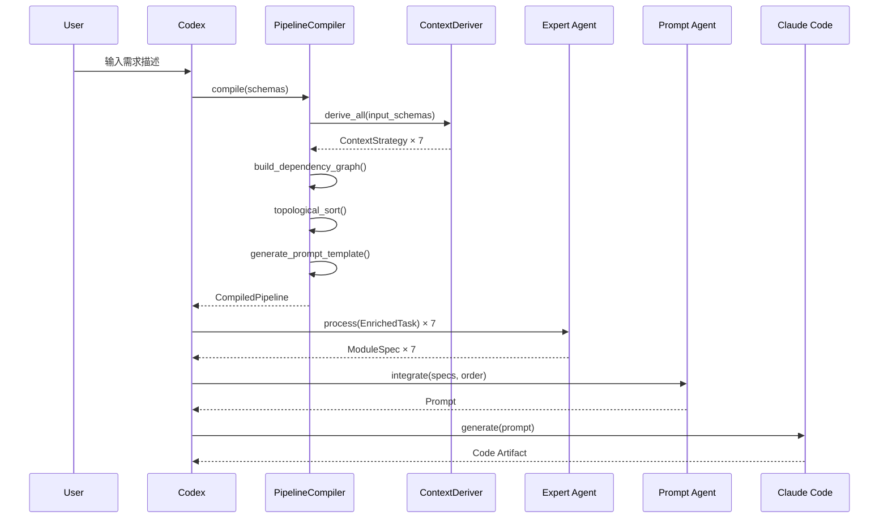
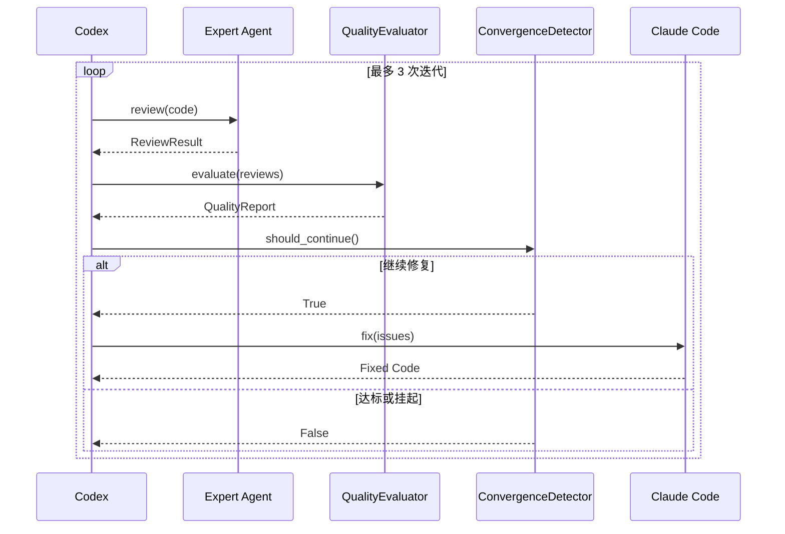

# Claude-Codex Multi-Agent 深化设计 Spec

> **版本**: v1.5 | **日期**: 2026-06-23 | **基于**: v1.4 + API 文档 + 序列图 + 配置参考

---

## 1. Prompt Agent 完整输出模板

### 1.1 模板结构

```markdown
# 项目: {{project_name}}

## 概述
{{project_description}}

## 技术栈
| 组件 | 选型 | 版本 |
|------|------|------|
| 语言 | {{language}} | {{lang_version}} |
| 框架 | {{framework}} | {{framework_version}} |

## 目录结构
{{directory_tree}}

## 实现顺序（拓扑排序）
{{implementation_order}}

## 全局约束
{{global_constraints}}

## 模块规格


### {{module.name}}
**负责专家**: {{module.expert_id}}
**置信度**: {{module.confidence}}

#### 组件列表

- **{{comp.name}}** ({{comp.type}}): {{comp.description}}


#### 接口定义

- **{{iface.name}}** `{{iface.method}} {{iface.path}}`
  - 输入: {{iface.input_schema}}
  - 输出: {{iface.output_schema}}


#### 验收标准

- [ ] {{ac}}




## 跨模块接口契约
{{interface_contracts}}

## 错误处理规范
{{error_handling}}

## 日志规范
{{logging_conventions}}
```

### 1.2 变量说明

| 变量 | 来源 | 说明 |
|------|------|------|
| `project_name` | Codex 从需求中提取 | 项目名称 |
| `implementation_order` | PipelineCompiler 拓扑排序 | 按依赖关系排序 |
| `module.components` | 各专家 Agent 输出 | 组件列表 |
| `interface_contracts` | Prompt Agent 生成 | 跨模块接口对齐 |
| `global_constraints` | Codex 注入 | 编码规范、技术栈约束 |

### 1.3 实现位置

模板生成逻辑位于 `tools/compiler/prompt_generator.py` 的 `PromptTemplateGenerator.generate()`。

---

## 2. 修复指令格式（Review Fix Instruction）

### 2.1 Schema 定义

```json
{
  "type": "fix_instruction",
  "task_id": "fix-001",
  "module": "auth",
  "priority": "critical",
  "issues": [
    {
      "issue_id": "I001",
      "severity": "critical",
      "location": "src/auth/service.py:42",
      "description": "Token 刷新逻辑缺少并发保护",
      "suggested_fix": "在 refresh_token 方法中添加分布式锁",
      "fix_type": "fix_security",
      "validation": "并发请求下不产生重复刷新"
    }
  ],
  "estimated_effort": "high"
}
```

### 2.2 修复类型枚举

> 由 `FixInstructionDeriver` 从 `output_schema` 自动推导。

| fix_type | 说明 | 触发条件 | 工作量 |
|----------|------|----------|--------|
| `add_component` | 添加缺失组件 | components 校验失败 | medium |
| `fix_interface` | 修复接口不一致 | interfaces 校验失败 | low |
| `fix_state_machine` | 修复状态机 | state_machine 存在且校验失败 | medium |
| `add_test` | 添加测试 | acceptance_criteria 未满足 | low |
| `fix_validation` | 修复校验逻辑 | 通用校验失败 | low |
| `fix_error_handling` | 修复错误处理 | 通用错误处理问题 | low |
| `fix_security` | 修复安全问题 | 认证/支付模块或 security_requirements | high |

### 2.3 修复指令流转

```
专家 Agent 审查 → 产出 fix_instruction
  → Superpowers 收集所有 fix_instructions
  → Codex 评估（去重、合并、排序）
  → 生成修复 Prompt
  → Claude Code 执行修复
  → 回到阶段二重新审查
```

---

## 3. 上下文注入机制（Context Injection Protocol）

### 3.1 注入规则

```
规则 1: 模块上下文 = 该模块的需求描述 + 验收标准
规则 2: 依赖接口 = 仅含依赖模块的 interface 定义（不含实现代码）
规则 3: 全局约束 = 编码规范 + 技术栈 + 目录结构
规则 4: 排除项 = 其他模块的任何信息（需求、实现、审查结果）
规则 5: 签名 = 所有注入内容由 Superpowers 签名，防篡改
```

### 3.2 运行时获取流程

```
1. Codex 完成需求拆分 → 输出 ModuleTaskList
2. Superpowers 对每个 ModuleTask:
   a. 从 RequirementStore 获取需求上下文
   b. 从 InterfaceStore 获取依赖模块接口
   c. 从 GlobalConfig 获取全局约束
   d. 组装 EnrichedTask → 注入到 ExpertAgent
3. ExpertAgent 处理 → 输出 ModuleSpec
4. Superpowers 收集所有 ModuleSpec → 存入 SpecStore
5. Prompt Agent 从 SpecStore 读取 → 整合
```

### 3.3 数据结构

```python
@dataclass
class EnrichedTask:
    task_id: str
    module_name: str
    module_context: str
    dependency_interfaces: Dict[str, InterfaceDef]
    global_constraints: GlobalConstraints
    signature: str

@dataclass
class InterfaceDef:
    name: str
    method: str
    path: str
    input_schema: Dict
    output_schema: Dict
    description: str

@dataclass
class GlobalConstraints:
    language: str
    framework: str
    coding_style: str
    directory_structure: str
    error_handling_policy: str
    logging_convention: str
```

---

## 4. 端到端数据流示例

**用户需求**: "构建在线商城，支持用户注册登录、商品浏览、购物车、下单、支付，以及订单通知和数据报表"

```
Step 1: Codex 解析需求
  → Requirement(functional_modules=["auth", "product", "cart", "order",
                          "payment", "notification", "report"])

Step 2: Codex 识别模块 → 匹配 Agent
  → ModuleTaskList([
      ModuleTask(module="auth",        priority=1, dependencies=[]),
      ModuleTask(module="product",     priority=2, dependencies=["auth"]),
      ModuleTask(module="cart",        priority=2, dependencies=["auth"]),
      ModuleTask(module="order",       priority=3, dependencies=["auth", "cart"]),
      ModuleTask(module="payment",     priority=4, dependencies=["auth", "order"]),
      ModuleTask(module="notification", priority=4, dependencies=["auth"]),
      ModuleTask(module="report",      priority=5, dependencies=["auth", "order"]),
    ])

Step 3: Superpowers 并行分发（7 个 Expert Agent 同时启动）
Step 4: 各专家产出 ModuleSpec（并行）
Step 5: Prompt Agent 整合 → 拓扑排序 → 生成完整 Prompt
Step 6: Claude Code 按顺序生成代码
Step 7-8: 分发代码 → 并行审查
Step 9: Codex 评估 → 质量评分 0.85
Step 10-11: 修复循环 → 重新审查通过
Step 12: 全部通过 → 交付（7 模块完整项目）
```

> 可执行版本见 `examples/ecommerce_trace.py`

### 4.1 编译流程序列图



### 4.2 修复循环序列图



---

## 5. Superpowers 与 Codex 集成方式

### 5.1 集成模式：事件驱动消息总线

> **架构决策**: 采用消息队列 + 事件驱动模型，不引入 REST API。

```
┌──────────────────────────────────────────────────────────┐
│                    Codex (主管)                           │
│  ┌──────────────┐  ┌──────────────┐  ┌───────────────┐  │
│  │ RequireParser │  │ TaskScheduler │  │ QualityEval   │  │
│  └──────┬───────┘  └──────┬───────┘  └──────┬────────┘  │
│         └────────┬────────┘                  │            │
│         ┌────────▼───────────────────────────▼──────────┐ │
│         │           Message Bus (消息总线)               │ │
│         │  publish(topic, message)                       │ │
│         │  subscribe(topic, handler)                     │ │
│         │  get_history(correlation_id)                   │ │
│         │  Topics: tasks.{module}, results.{module}     │ │
│         └───────────────────────────────────────────────┘ │
└──────────────────────────────────────────────────────────┘
```

### 5.2 消息总线 Topic 定义

| Topic | 生产者 | 消费者 | 消息类型 |
|-------|--------|--------|----------|
| `tasks.{module}` | Codex | Expert Agent | Task |
| `results.{module}` | Expert Agent | Superpowers | Result |
| `events.pipeline` | Superpowers | Codex | Event |
| `events.review` | Expert Agent | Codex | Review |
| `commands.fix` | Codex | Claude Code | Fix Instruction |

### 5.3 事件类型

```json
{
  "task_dispatched":      "任务已分发到 Agent",
  "task_completed":       "Agent 完成任务",
  "task_failed":          "Agent 任务失败",
  "review_completed":     "代码审查完成",
  "quality_gate_passed": "质量门禁通过",
  "quality_gate_failed": "质量门禁未通过",
  "fix_applied":          "修复已应用",
  "pipeline_completed":    "流水线完成"
}
```

---

## 6. Store 组件定义

### 6.1 三大 Store

| Store | 内容 | 写入时机 | 读取时机 |
|-------|------|----------|----------|
| RequirementStore | 各模块需求描述 + 约束 | Codex 拆分需求后 | ContextInjector 注入时 |
| InterfaceStore | 各模块的接口定义 | 专家 Agent 产出后 | ContextInjector 为依赖模块注入时 |
| SpecStore | 各模块完整 ModuleSpec | 专家 Agent 产出后 | Prompt Agent 整合时 |

### 6.2 RequirementStore

```python
class RequirementStore:
    def put(self, module: str, requirement: ModuleRequirement) -> None
    def get(self, module: str) -> Optional[ModuleRequirement]
    def get_for_injection(self, module: str) -> str
    def get_priority_order(self) -> List[str]
    def get_all_modules(self) -> List[str]
    def clear(self) -> None
```

### 6.3 InterfaceStore

```python
class InterfaceStore:
    def register_module(self, module: str, interfaces: List[InterfaceDef]) -> None
    def register_interface(self, module: str, interface: InterfaceDef) -> None
    def get_for_injection(self, module: str) -> str
    def get_interface(self, module: str, name: str) -> Optional[InterfaceDef]
    def get_interface_summary(self, module: str) -> str
    def get_all_modules(self) -> List[str]
    def get_cross_module_interfaces(self, module_names: List[str]) -> Dict[str, Dict[str, InterfaceDef]]
    def clear(self) -> None
```

### 6.4 SpecStore

```python
class SpecStore:
    def put(self, module: str, spec: ModuleSpec) -> None
    def get(self, module: str) -> Optional[ModuleSpec]
    def get_all(self) -> Dict[str, ModuleSpec]
    def get_ordered(self, module_order: List[str]) -> List[ModuleSpec]
    def get_all_acceptance_criteria(self) -> Dict[str, List[str]]
    def get_overall_confidence(self) -> float
    def get_modules_with_state_machine(self) -> List[str]
    def clear(self) -> None
```

---

## 7. 循环终止条件

### 7.1 修复循环约束

```
最大修复迭代次数: 3
终止条件（满足任一即终止）:
  1. 所有模块审查通过 AND 质量门禁全部通过 → 交付
  2. 修复迭代次数 >= 3 → 挂起，通知人工介入
  3. 出现 critical 级别问题且无法自动修复 → 挂起
  4. 连续 2 次修复后质量评分未提升 → 挂起
```

### 7.2 收敛判定

```python
class ConvergenceDetector:
    def __init__(self, max_iterations: int = 3, min_improvement: float = 0.02)
    def should_continue(
        self, iteration: int, quality_score: float, has_critical: bool
    ) -> Tuple[bool, str]
    def record_score(self, score: float) -> None
    def _calculate_trend(self) -> str  # "improving" | "stagnant" | "declining"
    def get_history(self) -> List[float]
    def reset(self) -> None
```

---

## 8. 待决事项

| # | 事项 | 状态 | 说明 |
|---|------|------|------|
| 1-11 | 各项设计决策 | ✅ 已解决 | 全部完成 |
| 12 | Store 持久化 | ⏳ 待确认 | 当前内存存储，可选数据库 |

---

## 9. 操作指南

### 9.1 如何新增功能模块

1. 在 `config/schemas/` 添加 `foo_input.json` / `foo_output.json`
2. 在 `config/agents.yaml` 注册 `expert_foo`
3. 在 `agents/experts/__init__.py` 添加 `FooExpert` 类并注册到 `expert_classes`
4. 运行测试验证

```yaml
expert_foo:
  role: "expert"
  module: "foo_module"
  input_schema: "schemas/foo_input.json"
  output_schema: "schemas/foo_output.json"
  dependencies:
    - authentication
```

### 9.2 如何修改全局约束

```python
compiler = PipelineCompiler(
    global_constraints={
        "language": "Python 3.12",
        "framework": "FastAPI",
        "max_function_lines": 50,  # 自定义
    }
)
```

### 9.3 如何自定义质量门禁

```python
suite.gates.append(QualityGate(
    name="custom_check",
    applies_to=["payment_integration"],
    metric="custom_metric",
    operator=">=",
    threshold=0.95,
    blocking=True,
))
```

### 9.4 如何调试编译产物

```python
compiled = compiler.compile(schemas, input_schemas=inputs)
print(compiled.explain())           # 完整报告
print(compiled.implementation_order) # 拓扑排序
print(compiled.context_strategies["auth"])  # 特定策略
print(compiled.fix_templates["order"].rules)  # 修复规则
```

### 9.5 运行端到端 Trace

```bash
python -B examples/ecommerce_trace.py
```

---

## 10. 部署与运维

### 10.1 本地开发

```bash
pip install pytest --break-system-packages
python -B -m pytest tests/ -v
```

### 10.2 生产部署 (Phase 3)

```bash
pip install fastapi uvicorn redis sqlalchemy
python -m tools.orchestrator --config config/
```

### 10.3 监控指标

| 指标 | 告警阈值 |
|------|----------|
| 编译耗时 | > 5s |
| 专家分析耗时 | > 30s |
| 修复循环次数 | > 2 |
| 质量评分 | < 0.8 |
| 消息队列深度 | > 100 |

---

## 11. API 参考

### 11.1 PipelineCompiler

```python
class PipelineCompiler:
    def __init__(
        self,
        requirement_store: RequirementStore = None,
        interface_store: InterfaceStore = None,
        spec_store: SpecStore = None,
        message_bus: MessageBus = None,
        global_constraints: Dict = None,
    )

    def compile(
        self,
        module_schemas: Dict[str, dict],    # {module_name: output_schema}
        agents_config: dict = None,          # agents.yaml 内容
        input_schemas: Dict[str, dict] = None,  # {module_name: input_schema}
        project_name: str = "Untitled",
        project_description: str = "",
    ) -> CompiledPipeline
    """编译流水线：读 Schema → 推导全部编排逻辑"""

    def compile_from_config(self, config_dir: str = "config") -> CompiledPipeline
    """从配置文件目录自动加载并编译"""
```

**返回 `CompiledPipeline`:**

```python
@dataclass
class CompiledPipeline:
    module_schemas: Dict[str, dict]           # 原始 output schemas
    context_strategies: Dict[str, ContextStrategy]  # 推导的上下文策略
    implementation_order: List[str]           # 拓扑排序结果
    dependency_graph: DependencyGraph         # 依赖图
    prompt_template: PromptTemplate           # 生成的 Prompt 模板
    fix_templates: Dict[str, FixTemplate]    # 各模块修复模板
    quality_gates: QualityGateSuite           # 质量门禁配置
    metadata: Dict[str, Any]                  # 编译元数据

    def to_superpowers_config(self) -> dict
    """转换为 Superpowers 运行时配置"""

    def explain(self) -> str
    """生成人类可读的编译报告"""
```

### 11.2 ContextDeriver

```python
class ContextDeriver:
    def derive(self, module_name: str, input_schema: dict) -> ContextStrategy
    """从单个 input_schema 推导上下文策略"""

    def derive_all(self, module_schemas: Dict[str, dict]) -> Dict[str, ContextStrategy]
    """批量推导所有模块的上下文策略"""

    def explain(self, strategy: ContextStrategy) -> str
    """生成推导说明（用于调试）"""
```

**ContextStrategy 字段:**

```python
@dataclass
class ContextStrategy:
    module_name: str
    needs_dependency_interfaces: bool = False
    needs_global_constraints: bool = True
    needs_security_context: bool = False
    needs_compliance_context: bool = False
    needs_business_rules: bool = False
    needs_search_requirements: bool = False
    depends_on: List[str] = field(default_factory=list)
    injectable_fields: List[str] = field(default_factory=list)
```

### 11.3 FixInstructionDeriver

```python
class FixInstructionDeriver:
    def derive(self, module_name: str, output_schema: dict) -> FixTemplate
    """从单个 output_schema 推导修复模板"""

    def derive_all(self, module_schemas: Dict[str, dict]) -> Dict[str, FixTemplate]
    """批量推导所有模块的修复模板"""
```

**FixTemplate 方法:**

```python
class FixTemplate:
    module_name: str
    rules: List[FixRule]

    def generate_fix_instructions(self, issues: List[dict]) -> List[dict]
    """根据问题和规则生成具体的修复指令"""
```

### 11.4 QualityGateGenerator

```python
class QualityGateGenerator:
    def generate(
        self,
        module_schemas: Dict[str, dict],
        global_config: Dict = None,
    ) -> QualityGateSuite
    """根据 Schema 特征生成质量门禁"""
```

### 11.5 ConvergenceDetector

```python
class ConvergenceDetector:
    def __init__(self, max_iterations: int = 3, min_improvement: float = 0.02)

    def should_continue(
        self, iteration: int, quality_score: float, has_critical: bool
    ) -> Tuple[bool, str]
    """判定是否继续修复循环。返回 (是否继续, 原因)"""

    def record_score(self, score: float) -> None
    """记录质量评分历史"""

    def _calculate_trend(self) -> str
    """计算质量趋势: "improving" | "stagnant" | "declining" """

    def get_history(self) -> List[float]
    """获取评分历史"""

    def reset(self) -> None
    """重置检测器"""
```

### 11.6 完整调用示例

```python
from tools.compiler import PipelineCompiler, ContextDeriver
from tools.stores import RequirementStore, InterfaceStore, SpecStore
from tools.quality import QualityEvaluator, ConvergenceDetector

# 1. 初始化
compiler = PipelineCompiler()
evaluator = QualityEvaluator()
detector = ConvergenceDetector(max_iterations=3)

# 2. 编译
compiled = compiler.compile(output_schemas, input_schemas=input_schemas)

# 3. 查看结果
print(compiled.explain())
print(f"实现顺序: {compiled.implementation_order}")
print(f"认证模块需要安全上下文: {compiled.context_strategies['auth'].needs_security_context}")

# 4. 质量评估
from tools.quality import ReviewResult
reviews = [ReviewResult(module=m, verdict="pass") for m in compiled.implementation_order]
report = evaluator.evaluate(reviews, iteration=0)

# 5. 收敛检测
should_continue, reason = detector.should_continue(
    iteration=0, quality_score=report.quality_score, has_critical=report.has_critical
)
print(f"继续修复: {should_continue}, 原因: {reason}")
```

---

## 12. 配置参考

### 12.1 agents.yaml 字段说明

```yaml
protocol_version: "1.0"      # 协议版本
pipeline_type: "dual_phase"   # 流水线类型

agents:
  # 主管 Agent
  codex_supervisor:
    role: "supervisor"          # 角色: supervisor | expert | plugin | integrator
    module: "orchestration"     # 模块名
    version: "1.0.0"            # 版本号
    capabilities:               # 能力列表
      - requirement_parsing
      - task_decomposition
      - result_aggregation
      - quality_evaluation
      - conflict_resolution
    max_concurrency: 1          # 最大并发数
    timeout_ms: 60000           # 超时（毫秒）

  # 专家 Agent
  expert_auth:
    role: "expert"
    module: "authentication"    # 模块名（用于 Schema 文件映射）
    version: "1.0.0"
    capabilities:               # 该专家的能力
      - jwt_auth
      - oauth2
      - session_management
    input_schema: "schemas/auth_input.json"   # 输入 Schema 路径
    output_schema: "schemas/auth_output.json" # 输出 Schema 路径
    max_concurrency: 3
    timeout_ms: 30000
    dependencies:               # 依赖的其他模块
      - user-database
    review_capabilities:        # 审查时的能力
      - security_audit
      - token_validation

  # Superpowers 插件
  superpowers:
    role: "plugin"
    module: "infrastructure"
    capabilities:
      - agent_registration
      - message_routing
      - context_injection
    config:
      max_agents: 20
      message_ttl_ms: 30000
      retry_policy:
        max_retries: 3
        backoff: "exponential"
        base_delay_ms: 2000

  # Prompt Agent
  prompt_agent:
    role: "integrator"
    module: "prompt_engineering"
    capabilities:
      - context_integration
      - conflict_detection
      - prompt_generation
```

### 12.2 Schema 文件规范

**input_schema 必须字段:**

```json
{
  "$schema": "http://json-schema.org/draft-07/schema#",
  "title": "ModuleInput",
  "description": "描述",
  "type": "object",
  "required": ["requirement", "constraints", "dependencies"],
  "properties": {
    "requirement": { "type": "string" },
    "constraints": { "type": "array", "items": { "type": "string" } },
    "dependencies": { "type": "array", "items": { "type": "string" } }
  }
}
```

**可选字段（触发特殊上下文注入）:**

| 字段 | 类型 | 触发的上下文 |
|------|------|-------------|
| `security_requirements` | `string[]` | 安全上下文 |
| `compliance_requirements` | `string[]` | 合规上下文 |
| `business_rules` | `string[]` | 业务规则 |
| `search_requirements` | `string[]` | 搜索需求 |
| `tech_stack` | `object` | 技术栈覆盖 |
| `dependency_interfaces` | `object` | 依赖接口注入 |

**output_schema 必须字段:**

```json
{
  "$schema": "http://json-schema.org/draft-07/schema#",
  "title": "ModuleOutput",
  "type": "object",
  "required": ["module_spec", "confidence", "reasoning"],
  "properties": {
    "module_spec": {
      "type": "object",
      "required": ["components", "acceptance_criteria"],
      "properties": {
        "components": { "type": "array", "items": { "type": "object" } },
        "interfaces": { "type": "array", "items": { "type": "object" } },
        "acceptance_criteria": { "type": "array", "items": { "type": "string" } },
        "state_machine": { "type": "object" }
      }
    },
    "confidence": { "type": "number", "minimum": 0, "maximum": 1 },
    "reasoning": { "type": "string" }
  }
}
```

**可选字段（触发特殊修复规则）:**

| 字段 | 类型 | 触发的修复规则 |
|------|------|---------------|
| `components` | `array` | `add_component` |
| `interfaces` | `array` | `fix_interface` |
| `state_machine` | `object` | `fix_state_machine` |
| `acceptance_criteria` | `array` | `add_test` |

### 12.3 完整 agents.yaml 示例

见 `config/agents.yaml`。

---

## 附录 A: 渐进式增强策略

| Phase | 触发条件 | 开发成本 |
|-------|---------|---------|
| 0: 纯 Superpowers | Agent ≤ 3 | 零 |
| 1: Python 编译器 (当前) | Agent > 3, Schema 校验 | 低 |
| 2: 质量评估器 | 算法化评估 + 收敛检测 | 中 |
| 3: 编排引擎 | 独立部署 + 持久化 | 高 |

| 条件 | Phase 0 | Phase 1 | Phase 2 | Phase 3 |
|------|---------|---------|---------|---------|
| Agent 数量 ≤ 3 | ✅ | ✅ | ✅ | ✅ |
| Agent 数量 4-7 | ❌ | ✅ | ✅ | ✅ |
| Schema 校验 | ❌ | ✅ | ✅ | ✅ |
| 算法化质量评估 | ❌ | ❌ | ✅ | ✅ |
| 独立部署 | ❌ | ❌ | ❌ | ✅ |
| 持久化存储 | ❌ | ❌ | ❌ | ✅ |
