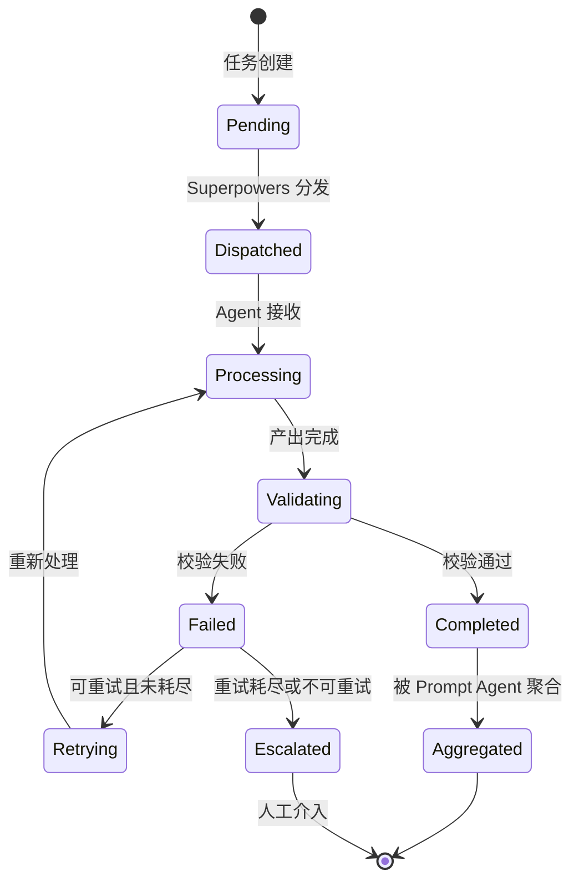
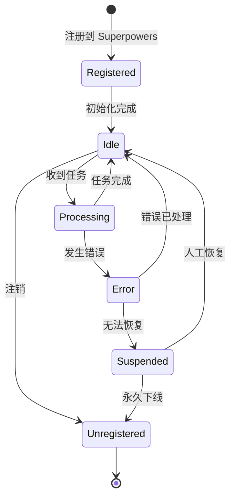

# 通信协议规范

> 本文档定义 Agent 间通信的消息格式、状态机、错误码和版本管理。

---

## 1. 消息格式

### 1.1 消息信封 (Message Envelope)

所有 Agent 间通信必须使用以下信封格式：

```json
{
  "meta": {
    "msg_id": "uuid-v4",
    "correlation_id": "uuid-v4",
    "timestamp": "2026-06-23T07:00:00Z",
    "from": "sender-agent-id",
    "to": "receiver-agent-id",
    "phase": "requirement_decomposition | code_review",
    "priority": "low | medium | high | critical",
    "ttl_ms": 30000,
    "protocol_version": "1.0"
  },
  "payload": {}
}
```

### 1.2 元数据字段说明

| 字段 | 类型 | 必填 | 说明 |
|------|------|------|------|
| `msg_id` | UUID | ✅ | 消息唯一标识 |
| `correlation_id` | UUID | ✅ | 关联 ID，用于追踪请求-响应链 |
| `timestamp` | ISO8601 | ✅ | 发送时间 |
| `from` | String | ✅ | 发送方 Agent ID |
| `to` | String | ✅ | 接收方 Agent ID |
| `phase` | Enum | ✅ | 当前阶段 |
| `priority` | Enum | ✅ | 优先级 |
| `ttl_ms` | Integer | ✅ | 消息有效期（毫秒） |
| `protocol_version` | String | ✅ | 协议版本 |

### 1.3 载荷类型 (Payload Types)

#### 任务载荷 (Task)

```json
{
  "type": "task",
  "task_id": "task-001",
  "action": "analyze | review",
  "module": "auth",
  "context": {
    "requirement": "基于 JWT 的登录注册功能",
    "constraints": ["RS256", "24h-ttl"],
    "dependencies": ["user-db", "redis"]
  },
  "input_schema_version": "1.0"
}
```

#### 结果载荷 (Result)

```json
{
  "type": "result",
  "task_id": "task-001",
  "status": "success | partial | failed",
  "output": {
    "module_spec": {},
    "confidence": 0.92,
    "reasoning": "分析过程说明"
  }
}
```

#### 审查载荷 (Review)

```json
{
  "type": "review",
  "task_id": "review-001",
  "module": "auth",
  "verdict": "pass | fail | conditional",
  "issues": [
    {
      "severity": "critical | major | minor | info",
      "location": "auth/service.py:42",
      "description": "Token 刷新逻辑缺少并发保护",
      "suggestion": "添加分布式锁"
    }
  ],
  "metrics": {
    "coverage": 0.85,
    "complexity": 12,
    "security_score": 0.9
  }
}
```

#### 错误载荷 (Error)

```json
{
  "type": "error",
  "task_id": "task-001",
  "error_code": "E001",
  "error_type": "validation | timeout | internal | dependency",
  "message": "输入 Schema 校验失败: 缺少必填字段 'requirement'",
  "retryable": true,
  "retry_after_ms": 2000
}
```

---

## 2. 错误码定义

| 代码 | 类型 | 说明 | 是否可重试 |
|------|------|------|-----------|
| E001 | validation | 输入校验失败 | ❌ |
| E002 | validation | 输出校验失败 | ✅ |
| E003 | timeout | 处理超时 | ✅ |
| E004 | internal | Agent 内部错误 | ✅ |
| E005 | dependency | 依赖模块不可用 | ✅ |
| E006 | conflict | 模块间冲突 | ❌ |
| E007 | schema_mismatch | Schema 版本不兼容 | ❌ |
| E008 | capacity | Agent 负载已满 | ✅ |
| E009 | authorization | 权限不足 | ❌ |
| E010 | unknown | 未知错误 | ❌ |

---

## 3. 状态机

### 3.1 任务生命周期



### 3.2 Agent 生命周期



### 3.3 状态转换规则

| 从 | 到 | 触发条件 | 校验 |
|----|----|---------|------|
| Pending → Dispatched | Superpowers 分发 | Agent 已注册 |
| Dispatched → Processing | Agent 确认接收 | TTL 未过期 |
| Processing → Validating | Agent 产出结果 | Agent 状态为 Processing |
| Validating → Completed | Schema 校验通过 | 输出符合 output_schema |
| Validating → Failed | Schema 校验失败 | 记录失败原因 |
| Failed → Retrying | 重试次数 < max_retry | error.retryable == true |
| Failed → Escalated | 重试耗尽或不可重试 | 通知 Codex |
| Completed → Aggregated | Prompt Agent 收集 | 所有模块完成 |

---

## 4. 版本管理

### 4.1 协议版本

```
主版本.次版本
  │      │
  │      └── 向后兼容的变更（新增字段、可选字段）
  └───────── 不兼容的变更（删除字段、修改语义）
```

### 4.2 Schema 版本策略

```json
{
  "schema_registry": {
    "auth_input": {
      "latest": "1.2.0",
      "supported": ["1.0.0", "1.1.0", "1.2.0"],
      "deprecated": ["0.9.0"]
    }
  }
}
```

### 4.3 兼容性规则

- 新增可选字段 → 次版本 +1
- 新增必填字段 → 主版本 +1
- 删除字段 → 主版本 +1
- 修改字段语义 → 主版本 +1

---

## 5. 安全约束

### 5.1 消息安全

| 约束 | 说明 |
|------|------|
| 身份验证 | 消息中的 `from` 字段必须与 Superpowers 注册 ID 一致 |
| 完整性 | 关键消息需包含校验和 |
| 时效性 | 超过 TTL 的消息自动丢弃 |
| 审计 | 所有消息记录到历史日志 |

### 5.2 上下文安全

| 约束 | 说明 |
|------|------|
| 最小权限 | Agent 只接收完成任务所需的最小上下文 |
| 隔离 | Agent A 无法获取 Agent B 的上下文 |
| 不可篡改 | 注入的上下文由 Superpowers 签名，Agent 无法修改 |

---

## 6. 性能约束

| 指标 | 目标值 | 说明 |
|------|--------|------|
| 消息延迟 | < 100ms | Superpowers 内部路由 |
| Agent 处理时间 | < 30s | 单个 Agent 处理任务 |
| 端到端延迟 | < 5min | 从需求输入到代码输出 |
| 并发 Agent 数 | ≤ 10 | 同时运行的专家 Agent |
| 消息队列深度 | ≤ 100 | 单 Agent 队列最大深度 |

---

*文档结束*
